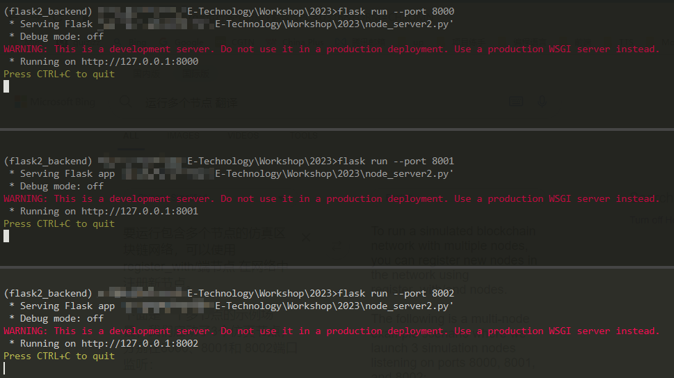
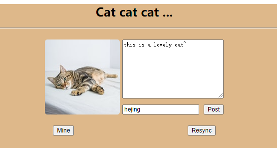
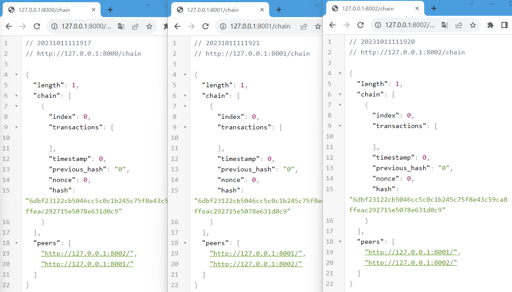
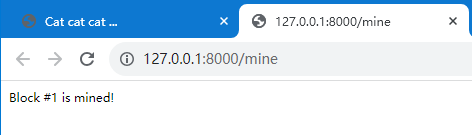
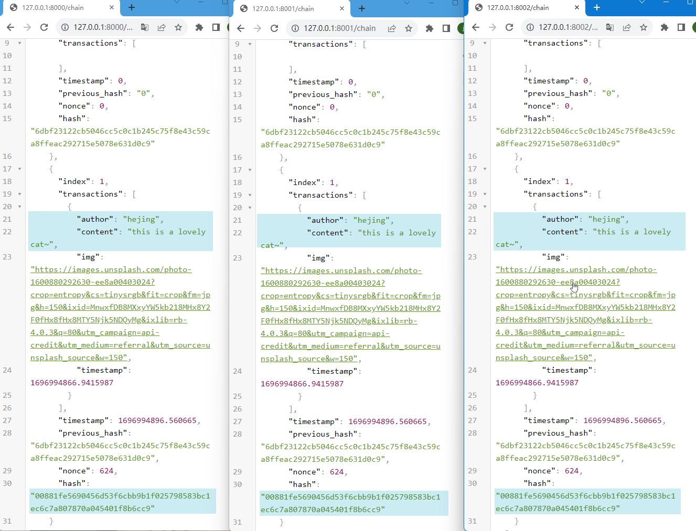

# A Simple Blockchian Application Tutorial in Python

> 2023/10/11

Blockchain is a way of storing digital data. The data can literally be anything. For Bitcoin, it’s the transactions (logs of transfers of Bitcoin from one account to another), but it can even be files; it doesn’t matter. The data is stored in the form of blocks, which are linked (or chained) together using cryptographic hashes — hence the name “blockchain.”

All of the magic lies in the way this data is stored and added to the blockchain. A blockchain is essentially a linked list that contains ordered data, with a few constraints such as:

- Blocks can’t be modified once added; in other words, it is append only.
- There are specific rules for appending data to it.
- Its architecture is distributed.

Enforcing these constraints yields the following benefits:

- Immutability and durability of data
- No single point of control or failure
- A verifiable audit trail of the order in which data was added

## Store transactions into blocks

We’ll be storing data in our blockchain in a format that’s widely used: JSON. Here’s what a post stored in blockchain will look like:

```py
{ 
  "author": "some_author_name", 
  "content": "Some thoughts that author wants to share", 
  "timestamp": "The time at which the content was created"
}
```

The generic term “data” is often replaced on the internet by the term “transactions.” So, just to avoid confusion and maintain consistency, we’ll be using the term “transaction” to refer to data in our example application.

The transactions are packed into blocks. A block can contain one or many transactions. The blocks containing the transactions are generated frequently and added to the blockchain. Because there can be multiple blocks, each block should have a unique ID.

```py
class Block:
    def __init__(self, index, transactions, timestamp):
        """
        Constructor for the `Block` class.
        :param index: Unique ID of the block.
        :param transactions: List of transactions.
        :param timestamp: Time of generation of the block.
        """
        self.index = index 
        self.transactions = transactions 
        self.timestamp = timestamp
```

## Add digital fingerprints to the blocks
We’d like to prevent any kind of tampering in the data stored inside the block, and detection is the first step to that. To detect if the data in the block has been tampered with, you can use cryptographic hash functions.

A hash function is a function that takes data of any size and produces data of a fixed size from it (a hash), which is generally used to identify the input. The characteristics of an ideal hash function are:

- It should be easy to compute.
- It should be deterministic, meaning the same data will always result in the same hash.
- It should be uniformly random, meaning even a single bit change in the data should change the hash significantly.

The consequence of this is:

- It is virtually impossible to guess the input data given the hash. (The only way is to try all possible input combinations.)
- If you know both the input and the hash, you can simply pass the input through the hash function to verify the provided hash.

This asymmetry of efforts that’s required to figure out the hash from an input (easy) vs. figuring out the input from a hash (almost impossible) is what blockchain leverages to obtain the desired characteristics.

We’ll store the hash of the block in a field inside our Block object, and it will act like a digital fingerprint (or signature) of data contained in it:

```py
from hashlib import sha256
import json

def compute_hash(block):
    """
    Returns the hash of the block instance by first converting it
    into JSON string.
    """
    block_string = json.dumps(self.__dict__, sort_keys=True)
    return sha256(block_string.encode()).hexdigest()
```

`Note`: In most cryptocurrencies, even the individual transactions in the block are hashed and then stored to form a hash tree (also known as a merkle tree). The root of the tree usually represents the hash of the block. It’s not a necessary requirement for the functioning of the blockchain, so we’re omitting it to keep things simple.

## Chain the blocks

Okay, we’ve now set up the blocks. The blockchain is supposed to be a collection of blocks. We can store all the blocks in the Python list (the equivalent of an array). But this is not sufficient, because what if someone intentionally replaces an old block with a new block in the collection? Creating a new block with altered transactions, computing the hash, and replacing it with any older block is no big deal in our current implementation.

We need a way to make sure that any change in the previous blocks invalidates the entire chain. The Bitcoin way to do this is to create dependency among consecutive blocks by chaining them with the hash of the block immediately previous to them. By chaining here, we mean to include the hash of the previous block in the current block in a new field called previous_hash.

Okay, if every block is linked to the previous block through the previous_hash field, what about the very first block? That block is called the genesis block and it can be generated either manually or through some unique logic. Let’s add the previous_hash field to the Block class and implement the initial structure of our Blockchain class.

```py
from hashlib import sha256
import json
import time


class Block:
    def__init__(self, index, transactions, timestamp, previous_hash):
        """
        Constructor for the `Block` class.
        :param index:         Unique ID of the block.
        :param transactions:  List of transactions.
        :param timestamp:     Time of generation of the block.
        :param previous_hash: Hash of the previous block in the chain which this block is part of.                                        
        """
        self.index = index
        self.transactions = transactions
        self.timestamp = timestamp
        self.previous_hash = previous_hash # Adding the previous hash field

    def compute_hash(self):
        """
        Returns the hash of the block instance by first converting it
        into JSON string.
        """
        block_string = json.dumps(self.__dict__, sort_keys=True) # The string equivalent also considers the previous_hash field now
        return sha256(block_string.encode()).hexdigest()

class Blockchain:

    def __init__(self):
        """
        Constructor for the `Blockchain` class.
        """
        self.chain = []
        self.create_genesis_block()

    def create_genesis_block(self):
        """
        A function to generate genesis block and appends it to
        the chain. The block has index 0, previous_hash as 0, and
        a valid hash.
        """
        genesis_block = Block(0, [], time.time(), "0")
        genesis_block.hash = genesis_block.compute_hash()
        self.chain.append(genesis_block)


    def last_block(self):
        """
        A quick pythonic way to retrieve the most recent block in the chain. Note that
        the chain will always consist of at least one block (i.e., genesis block)
        """
        return self.chain[-1]
```

Now, if the content of any of the previous blocks changes: - The hash of that previous block would change. - This will lead to a mismatch with the previous_hash field in the next block. - Since the input data to compute the hash of any block also consists of the previous_hash field, the hash of the next block will also change.

Ultimately, the entire chain following the replaced block is invalidated, and the only way to fix it is to recompute the entire chain.

## Implement a proof of work algorithm
There is one problem, though. If we change the previous block, the hashes of all the blocks that follow can be re-computed quite easily to create a different valid blockchain. To prevent this, we can exploit the asymmetry in efforts of hash functions that we discussed earlier to make the task of calculating the hash difficult and random. Here’s how we do this: Instead of accepting any hash for the block, we add some constraint to it. Let’s add a constraint that our hash should start with “n leading zeroes” where n can be any positive integer.

We know that unless we change the data of the block, the hash is not going to change, and of course we don’t want to change existing data. So what do we do? Simple! We’ll add some dummy data that we can change. Let’s introduce a new field in our block called nonce. A nonce is a number that we can keep on changing until we get a hash that satisfies our constraint. The nonce satisfying the constraint serves as proof that some computation has been performed. This technique is a simplified version of the Hashcash algorithm used in Bitcoin. The number of zeroes specified in the constraint determines the difficulty of our proof of work algorithm (the greater the number of zeroes, the harder it is to figure out the nonce).

Also, due to the asymmetry, proof of work is difficult to compute but very easy to verify once you figure out the nonce (you just have to run the hash function again):

```py
class Blockchain:
    # difficulty of PoW algorithm
    difficulty = 2

    """
    Previous code contd..
    """

    def proof_of_work(self, block):
        """
        Function that tries different values of the nonce to get a hash
        that satisfies our difficulty criteria.
        """
        block.nonce = 0

        computed_hash = block.compute_hash()
        while not computed_hash.startswith('0' * Blockchain.difficulty):
            block.nonce += 1
            computed_hash = block.compute_hash()

        return computed_hash
```

Notice that there is no specific logic to figuring out the nonce quickly; it’s just brute force. The only definite improvement that you can make is to use hardware chips that are specially designed to compute the hash function in a smaller number of CPU instructions.

## Add blocks to the chain
To add a block to the chain, we’ll first have to verify that:

- The data has not been tampered with (the proof of work provided is correct).
- The order of transactions is preserved (the previous_hash field of the block to be added points to the hash of the latest block in our chain).

Let’s see the code for adding blocks into the chain:

```py
class Blockchain:
    """
    Previous code contd..
    """

    def add_block(self, block, proof):
        """
        A function that adds the block to the chain after verification.
        Verification includes:
        * Checking if the proof is valid.
        * The previous_hash referred in the block and the hash of a latest block
          in the chain match.
        """
        previous_hash = self.last_block.hash

        if previous_hash != block.previous_hash:
            return False

        if not Blockchain.is_valid_proof(block, proof):
            return False

        block.hash = proof
        self.chain.append(block)
        return True

    def is_valid_proof(self, block, block_hash):
        """
        Check if block_hash is valid hash of block and satisfies
        the difficulty criteria.
        """
        return (block_hash.startswith('0' * Blockchain.difficulty) and
                block_hash == block.compute_hash())
```

## Mining
The transactions will be initially stored as a pool of unconfirmed transactions. The process of putting the unconfirmed transactions in a block and computing proof of work is known as the mining of blocks. Once the nonce satisfying our constraints is figured out, we can say that a block has been mined and it can be put into the blockchain.

In most of the cryptocurrencies (including Bitcoin), miners may be awarded some cryptocurrency as a reward for spending their computing power to compute a proof of work. Here’s what our mining function looks like:

```py
class Blockchain:

    def __init__(self):
        self.unconfirmed_transactions = [] # data yet to get into blockchain
        self.chain = []
        self.create_genesis_block()

    """
    Previous code contd...
    """

    def add_new_transaction(self, transaction):
        self.unconfirmed_transactions.append(transaction)

    def mine(self):
        """
        This function serves as an interface to add the pending
        transactions to the blockchain by adding them to the block
        and figuring out proof of work.
        """
        if not self.unconfirmed_transactions:
            return False

        last_block = self.last_block

        new_block = Block(index=last_block.index + 1,
                          transactions=self.unconfirmed_transactions,
                          timestamp=time.time(),
                          previous_hash=last_block.hash)

        proof = self.proof_of_work(new_block)
        self.add_block(new_block, proof)
        self.unconfirmed_transactions = []
        return new_block.index
```

## Combined Code
```py
from hashlib import sha256
import json
import time


class Block:
    def __init__(self, index, transactions, timestamp, previous_hash):
        self.index = index
        self.transactions = transactions
        self.timestamp = timestamp
        self.previous_hash = previous_hash
        self.nonce = 0

    def compute_hash(self):
        """
        A function that return the hash of the block contents.
        """
        block_string = json.dumps(self.__dict__, sort_keys=True)
        return sha256(block_string.encode()).hexdigest()


class Blockchain:
    # difficulty of our PoW algorithm
    difficulty = 2

    def __init__(self):
        self.unconfirmed_transactions = []
        self.chain = []
        self.create_genesis_block()

    def create_genesis_block(self):
        """
        A function to generate genesis block and appends it to
        the chain. The block has index 0, previous_hash as 0, and
        a valid hash.
        """
        genesis_block = Block(0, [], time.time(), "0")
        genesis_block.hash = genesis_block.compute_hash()
        self.chain.append(genesis_block)


    def last_block(self):
        return self.chain[-1]

    def add_block(self, block, proof):
        """
        A function that adds the block to the chain after verification.
        Verification includes:
        * Checking if the proof is valid.
        * The previous_hash referred in the block and the hash of latest block
          in the chain match.
        """
        previous_hash = self.last_block.hash

        if previous_hash != block.previous_hash:
            return False

        if not self.is_valid_proof(block, proof):
            return False

        block.hash = proof
        self.chain.append(block)
        return True

    def is_valid_proof(self, block, block_hash):
        """
        Check if block_hash is valid hash of block and satisfies
        the difficulty criteria.
        """
        return (block_hash.startswith('0' * Blockchain.difficulty) and
                block_hash == block.compute_hash())

    def proof_of_work(self, block):
        """
        Function that tries different values of nonce to get a hash
        that satisfies our difficulty criteria.
        """
        block.nonce = 0

        computed_hash = block.compute_hash()
        while not computed_hash.startswith('0' * Blockchain.difficulty):
            block.nonce += 1
            computed_hash = block.compute_hash()

        return computed_hash

    def add_new_transaction(self, transaction):
        self.unconfirmed_transactions.append(transaction)

    def mine(self):
        """
        This function serves as an interface to add the pending
        transactions to the blockchain by adding them to the block
        and figuring out Proof Of Work.
        """
        if not self.unconfirmed_transactions:
            return False


        new_block = Block(index=last_block.index + 1,
                          transactions=self.unconfirmed_transactions,
                          timestamp=time.time(),
                          previous_hash=self.last_block.hash)

        proof = self.proof_of_work(new_block)
        self.add_block(new_block, proof)

        self.unconfirmed_transactions = []
        return new_block.index
```

## Create interfaces
Okay, now it’s time to create interfaces for our blockchain node to interact with the application we’re going to build. We’ll be using a popular Python microframework called Flask to create a REST API that interacts with and invokes various operations in our blockchain node. If you’ve worked with any web framework before, the code below shouldn’t be difficult to follow along.

These REST endpoints can be used to play around with our blockchain by creating some transactions and then mining them.

```py
from flask import Flask, request
import requests

# Initialize flask application
app =  Flask(__name__)

# Initialize a blockchain object.
blockchain = Blockchain()


### We need an endpoint for our application to submit a new transaction. This will be used by our application to add new data (posts) to the blockchain:

# Flask's way of declaring end-points

def new_transaction():
    tx_data = request.get_json()
    required_fields = ["author", "content"]

    for field in required_fields:
        if not tx_data.get(field):
            return "Invalid transaction data", 404

    tx_data["timestamp"] = time.time()

    blockchain.add_new_transaction(tx_data)

    return "Success", 201


### Here’s an endpoint to return the node’s copy of the chain. Our application will be using this endpoint to query all of the data to display:


def get_chain():
    chain_data = []
    for block in blockchain.chain:
        chain_data.append(block.__dict__)
    return json.dumps({"length": len(chain_data),
                       "chain": chain_data})

# Here’s an endpoint to request the node to mine the unconfirmed transactions (if any). We’ll be using it to initiate a command to mine from our application itself:


def mine_unconfirmed_transactions():
    result = blockchain.mine()
    if not result:
        return "No transactions to mine"
    return "Block #{} is mined.".format(result)


def get_pending_tx():
    return json.dumps(blockchain.unconfirmed_transactions)
```


## Establish consensus and decentralization

Up to this point, the blockchain that we’ve implemented is meant to run on a single computer. Even though we’re linking block with hashes and applying the proof of work constraint, we still can’t trust a single entity (in our case, a single machine). We need the data to be distributed, we need multiple nodes maintaining the blockchain. So, to transition from a single node to a peer-to-peer network, let’s first create a mechanism to let a new node become aware of other peers in the network:

```py
# Contains the host addresses of other participating members of the network
peers = set()

# Endpoint to add new peers to the network

def register_new_peers():
    # The host address to the peer node 
    node_address = request.get_json()["node_address"]
    if not node_address:
        return "Invalid data", 400

    # Add the node to the peer list
    peers.add(node_address)

    # Return the blockchain to the newly registered node so that it can sync
    return get_chain()


def register_with_existing_node():
    """
    Internally calls the `register_node` endpoint to
    register current node with the remote node specified in the
    request, and sync the blockchain as well with the remote node.
    """
    node_address = request.get_json()["node_address"]
    if not node_address:
        return "Invalid data", 400

    data = {"node_address": request.host_url}
    headers = {'Content-Type': "application/json"}

    # Make a request to register with remote node and obtain information
    response = requests.post(node_address + "/register_node",
                             data=json.dumps(data), headers=headers)

    if response.status_code == 200:
        global blockchain
        global peers
        # update chain and the peers
        chain_dump = response.json()['chain']
        blockchain = create_chain_from_dump(chain_dump)
        peers.update(response.json()['peers'])
        return "Registration successful", 200
    else:
        # if something goes wrong, pass it on to the API response
        return response.content, response.status_code


def create_chain_from_dump(chain_dump):
    blockchain = Blockchain()
    for idx, block_data in enumerate(chain_dump):
        block = Block(block_data["index"],
                      block_data["transactions"],
                      block_data["timestamp"],
                      block_data["previous_hash"])
        proof = block_data['hash']
        if idx > 0:
            added = blockchain.add_block(block, proof)
            if not added:
                raise Exception("The chain dump is tampered!!")
        else:  # the block is a genesis block, no verification needed
            blockchain.chain.append(block)
    return blockchain
```

A new node participating in the network can invoke the register_with_existing_node method (via the /register_with endpoint) to register with existing nodes in the network. This will help with the following:

- Asking the remote node to add a new peer to its list of known peers.
- Initializing the blockchain of the new node with that of the remote node.
- Resyncing the blockchain with the network if the node goes off-grid.

However, there’s a problem with multiple nodes. Due to intentional manipulation or unintentional reasons (like network latency), the copy of chains of a few nodes can differ. In that case, the nodes need to agree upon some version of the chain to maintain the integrity of the entire system. In other words, we need to achieve consensus.

A simple consensus algorithm could be to agree upon the longest valid chain when the chains of different participating nodes in the network appear to diverge. The rationale behind this approach is that the longest chain is a good estimate of the most amount of work done (remember proof of work is difficult to compute):

```py
class Blockchain
    """
    previous code continued...
    """
    def check_chain_validity(cls, chain):
        """
        A helper method to check if the entire blockchain is valid.            
        """
        result = True
        previous_hash = "0"

        # Iterate through every block
        for block in chain:
            block_hash = block.hash
            # remove the hash field to recompute the hash again
            # using `compute_hash` method.
            delattr(block, "hash")

            if not cls.is_valid_proof(block, block.hash) or \
                    previous_hash != block.previous_hash:
                result = False
                break

            block.hash, previous_hash = block_hash, block_hash

        return result

def consensus():
    """
    Our simple consensus algorithm. If a longer valid chain is
    found, our chain is replaced with it.
    """
    global blockchain

    longest_chain = None
    current_len = len(blockchain.chain)

    for node in peers:
        response = requests.get('{}/chain'.format(node))
        length = response.json()['length']
        chain = response.json()['chain']
        if length > current_len and blockchain.check_chain_validity(chain):
              # Longer valid chain found!
            current_len = length
            longest_chain = chain

    if longest_chain:
        blockchain = longest_chain
        return True

    return False

```

Next, we need to develop a way for any node to announce to the network that it has mined a block so that everyone can update their blockchain and move on to mine other transactions. Other nodes can simply verify the proof of work and add the mined block to their respective chains (remember that verification is easy once the nonce is known):

```py
# endpoint to add a block mined by someone else to
# the node's chain. The node first verifies the block
# and then adds it to the chain.

def verify_and_add_block():
    block_data = request.get_json()
    block = Block(block_data["index"],
                  block_data["transactions"],
                  block_data["timestamp"],
                  block_data["previous_hash"])

    proof = block_data['hash']
    added = blockchain.add_block(block, proof)

    if not added:
        return "The block was discarded by the node", 400

    return "Block added to the chain", 201


def announce_new_block(block):
    """
    A function to announce to the network once a block has been mined.
    Other blocks can simply verify the proof of work and add it to their
    respective chains.
    """
    for peer in peers:
        url = "{}add_block".format(peer)
        requests.post(url, data=json.dumps(block.__dict__, sort_keys=True))


```

The announce_new_block method should be called after every block is mined by the node so that peers can add it to their chains.

```py
@app.route('/mine', methods=['GET'])
def mine_unconfirmed_transactions():
    result = blockchain.mine()
    if not result:
        return "No transactions to mine"
    else:
        # Making sure we have the longest chain before announcing to the network
        chain_length = len(blockchain.chain)
        consensus()
        if chain_length == len(blockchain.chain):
            # announce the recently mined block to the network
            announce_new_block(blockchain.last_block)
        return "Block #{} is mined.".format(blockchain.last_block.index)
```

## Build the application
Now, it’s time to start working on the interface of our application. We’ve used Jinja2 templating to render the web pages and some CSS to make things look nice.

Our application needs to connect to a node in the blockchain network to fetch the data and also to submit new data. There can also be multiple nodes, as well.

```py
import datetime
import json

import requests
from flask import render_template, redirect, request

from app import app

# Node in the blockchain network that our application will communicate with
# to fetch and add data.
CONNECTED_NODE_ADDRESS = "http://127.0.0.1:8000"

posts = []
```

The fetch_posts function gets the data from the node’s /chain endpoint, parses the data, and stores it locally.

```py
def fetch_posts():
    """
    Function to fetch the chain from a blockchain node, parse the
    data, and store it locally.
    """
    get_chain_address = "{}/chain".format(CONNECTED_NODE_ADDRESS)
    response = requests.get(get_chain_address)
    if response.status_code == 200:
        content = []
        chain = json.loads(response.content)
        for block in chain["chain"]:
            for tx in block["transactions"]:
                tx["index"] = block["index"]
                tx["hash"] = block["previous_hash"]
                content.append(tx)

        global posts
        posts = sorted(content,
                       key=lambda k: k['timestamp'],
                       reverse=True)
```

The application has an HTML form to take user input and then makes a POST request to a connected node to add the transaction into the unconfirmed transactions pool. The transaction is then mined by the network, and then finally fetched once we refresh our web page:

```py
@app.route('/submit', methods=['POST'])
def submit_textarea():
    """
    Endpoint to create a new transaction via our application
    """
    post_content = request.form["content"]
    author = request.form["author"]

    post_object = {
        'author': author,
        'content': post_content,
    }

    # Submit a transaction
    new_tx_address = "{}/new_transaction".format(CONNECTED_NODE_ADDRESS)

    requests.post(new_tx_address,
                  json=post_object,
                  headers={'Content-type': 'application/json'})

    # Return to the homepage
    return redirect('/')
```

## How to run the application

Clone the project repository.

```
## Gitee 
git clone https://gitee.com/2010jing/Python-Blockchain-Tutorial.git

## Github
git clone https://github.com/2010jing/Python-Blockchain-Tutorial.git

```

Install the necessary Python project dependencies 

```
Flask~=1.1
requests~=2.22
```

Launch the block chain

```
# Linux use export
export FLASK_APP=[Your-Project-Path]node_server.py

# Windows use set (cmd)
set FLASK_APP=[Your-Project-Path]node_server.py

```

### Run multiple nodes

To run a simulated blockchain network with multiple nodes, you can register new nodes in the network using `register_with/` end nodes.

The following is a multi-node example scenario where we launch 3 simulation nodes listening on ports 8000, 8001, and 8002:
```
flask run --port 8000

flask run --port 8001

flask run --port 8002
```



Two new nodes listening on ports 8001 and 8002 can be registered using the following cURL or  Postman request:

```
$ curl -X POST \
  http://127.0.0.1:8001/register_with \
  -H 'Content-Type: application/json' \
  -d '{"node_address": "http://127.0.0.1:8000"}'

$ curl -X POST \
  http://127.0.0.1:8002/register_with \
  -H 'Content-Type: application/json' \
  -d '{"node_address": "http://127.0.0.1:8000"}'
```

For this tutorial, we use `requests` to complete above registration. See the `run_app.py` file.

This allows nodes listening on port 8000 to know that there are also nodes listening on 8001 and 8002, and vice versa. The newly added node will also synchronize the blockchain data from the original on-network node, so that the new node can participate in the subsequent mining process.

Launch another terminal to run our decentralized application:
```
python run_app.py
```

Now that the app has been launched, it can be accessed via this URL: http://localhost:5000.



This is a simple blog posts a diary about cats.

The chains of the nodes before minging:



The following diagram shows how to start node mining using the web interface:



After mining:





## How to verify transactions

You may have noticed that our decentralized application based on simulated blockchains has a flaw: anyone can submit anything at any time. One solution to this problem is to create user accounts using asymmetric key technology. Each new user needs a public key (corresponding to the account name) and a private key to submit data in our application. The private key is used to create the signature of the data, while the public key is used to verify the signature of the data, and here's how it works:

- Each new transaction submitted is signed with the user's private key. This signature is added to the transaction data along with the user information
- In the verification phase, when mining, we can use the public key and signature to verify that the sender and signature generated in the data match, and verify that the message has been modified.

## Summary

In this tutorial, we learned the basic concepts of a public chain and implemented a simulated blockchain using Python and a Flask application based on this simulated blockchain. If you have completed the entire tutorial, I believe you should be able to use Python to implement a blockchain from scratch and develop your own decentralized applications based on this simulated blockchain, or use this simulated blockchain network to conduct some research experiments. The blockchain implementation in the tutorial is not as complex as Bitcoin or Ethereum, but it is believed that it will help to understand the core problems and solutions of blockchain technology.


## Reference
- https://developer.ibm.com/tutorials/develop-a-blockchain-application-from-scratch-in-python/
- http://blog.hubwiz.com/2020/04/01/python-sim-blockchain/

